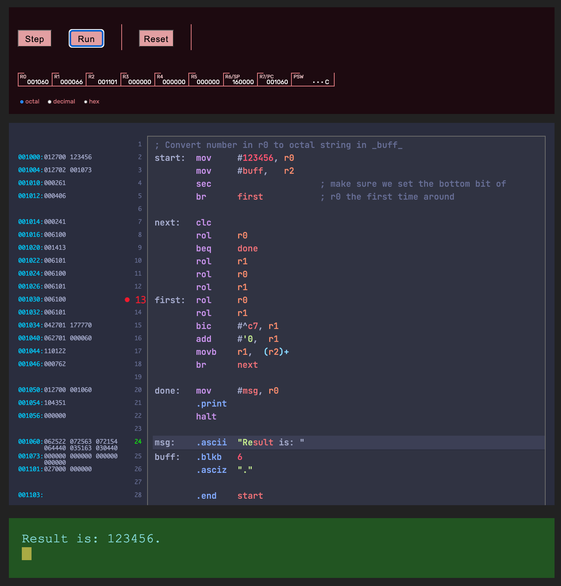
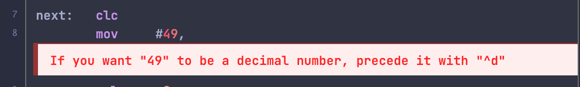

### NOT YET USABLE

# PDP-11 Playground

An(other) implementation of a PDP-11 assembler and emulator that runs in the browser.

Unlike the others, this version doesn't require an operating system, and it is
designed to give more meaningful errors. It also features breakpoints, and it
can switch from the deult octal representation to either decimal or hex for
anyone born after 1970.

## TL:DR

#### For End-Users

* [How to Use the Playground](#using-the-playground)

#### For Developers

* [Installation](#installation)
* [API](#API)

#### For Folks Who Want To Hack the Code

* [Working with the Code Base](#working-with-the-code-base)

----

### Why Another PDP-11 Emulator?

I'm creating a course about how computers work. Part of it looks at internal
architecture, machine code, memory, registers, processor status, and so on.

The PDP-11 is an elegant, simple, and surprisingly complete machine. It lets
me talk about these things without getting in the way.

The only in-browser emulators I could find were either so realistic that they
needed to boot a DEC operating system to be useful, or very terse when it came
to supporting new users.

### What This Is

Create webpages containing placeholder `div`s and point this library at them.

The library will create an editor window, a machine status area, and a set of
control buttons.

The editor knows about PDP-11 assembler syntax, and performs incremental
assembly as you type. When it encounters a syntax error, it tries to show you
just the text in error:

Whenever the source code assembles cleanly, the playground is ready to run the
code. It shows STEP/RUN/RESET buttons and the contents of the processor
registers (including the PSW).

As you step through the code the currently executing line is highlighted in the
editor. The registers and memory dump (at the left of the source code) show
when locations are read and written, along with their new values.

Clicking on a line number sets a breakpoint.

Although the environment does not have an I/O subsystem, it does emulate some
basic console output macros (`.ttyout` and `.print`).

### What This Is Not

* The built-in assembler is based on DEC's Macro-11 Assembler, but without the
  macros and the sectioning control.

* The PDP-11 Playground is not a complete PDP-11 computer; it's just an
  emulation of the processor. There's no I/O subsystem or memory management
  unit, so it will not boot DEC operating systems.

----

# For Users of the Playground

### Using The Playground

# Adding the Playground to Your Site

### Installation
### API

# Contributing to this Repo

### Working With The Code Base

### Author

Copyright © 2021 Dave Thomas (pragdave)

### License

[MIT](./LICENSE.md)

